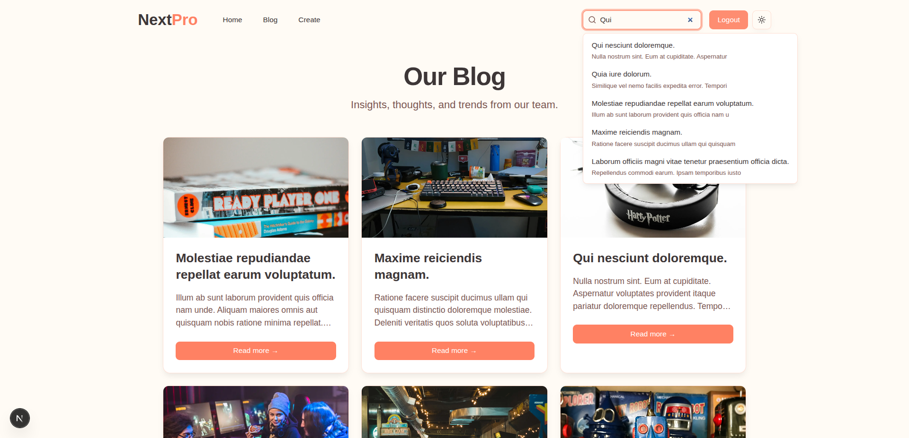
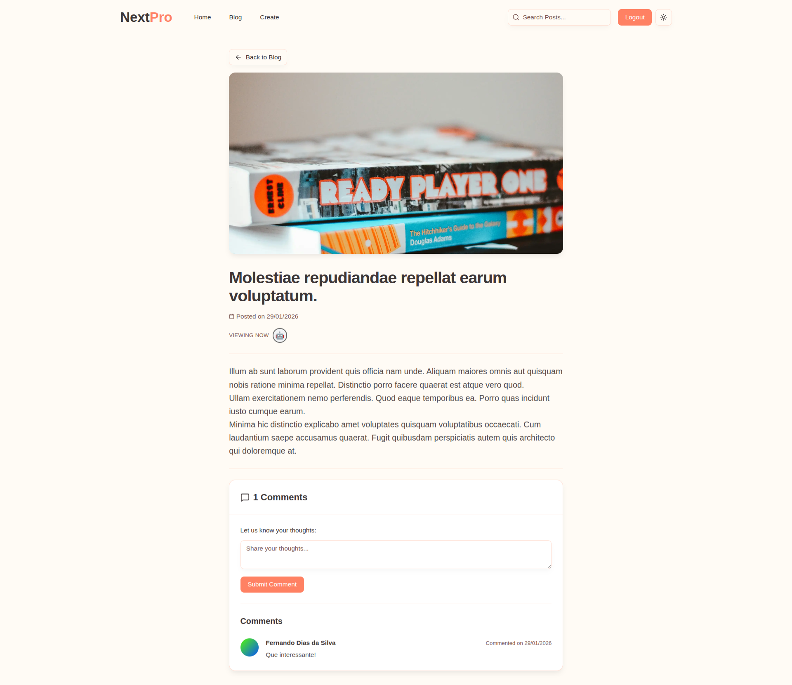

# Next Blog App

<p align="center">
  
</p>

<p align="center">
  
  
  
  
  
  
</p>

Full-stack blog app built with Next.js App Router, Convex, and Better Auth. Includes a public blog, authenticated post creation, real-time comments, presence, global search, caching, and image uploads via presigned URLs.

## Table of Contents

- [Features](#features)
- [Tech Stack](#tech-stack)
- [Getting Started](#getting-started)
- [Environment Variables](#environment-variables)
- [Scripts](#scripts)
- [Project Structure](#project-structure)
- [API Routes](#api-routes)
- [Screenshots](#screenshots)
- [Notes and Deployment](#notes-and-deployment)

## Features

- Public blog listing and post detail pages
- Auth flows with email/password (Better Auth)
- Post creation with server actions and Zod validation
- Image uploads using Convex Storage presigned URLs
- Route-level loading states and cache tags/revalidation
- Real-time comments and presence per post (Convex subscriptions)
- Global search backed by Convex full-text indexes
- Dark mode + responsive UI (shadcn/ui + Tailwind v4)

## Tech Stack

- Next.js 16 (App Router, Server Components, Server Actions)
- React 19
- Convex (database, realtime, file storage)
- Better Auth (email/password)
- Tailwind CSS v4 + shadcn/ui
- React Hook Form + Zod
- TypeScript
- ESLint + Prettier

## Getting Started

### Prerequisites

- Node.js 20+
- Convex account (for deployment URLs and storage)

### Install

```bash
npm install
```

### Run Convex (Terminal 1)

```bash
npx convex dev
```

### Run Next.js (Terminal 2)

```bash
npm run dev
```

Open `http://localhost:3000`.

## Environment Variables

Create a `.env.local` file in the project root (do not commit secrets):

```bash
# Convex dev deployment used by `npx convex dev`
CONVEX_DEPLOYMENT=dev:your-deployment

# Required by the Next.js app
NEXT_PUBLIC_CONVEX_URL=https://your-deployment.convex.cloud
NEXT_PUBLIC_CONVEX_SITE_URL=https://your-deployment.convex.site

# Required by Convex (server-side) auth configuration
# Set this in your Convex environment: `npx convex env set SITE_URL http://localhost:3000`
SITE_URL=http://localhost:3000
```

Notes:
- `SITE_URL` is read inside `convex/auth.ts` and must exist in Convex envs (local and prod).
- `NEXT_PUBLIC_CONVEX_URL` and `NEXT_PUBLIC_CONVEX_SITE_URL` must match your Convex deployment.

## Scripts

- `npm run dev` start the Next.js dev server
- `npm run build` build for production
- `npm run start` run the production server
- `npm run lint` run ESLint
- `npm run lint:fix` run ESLint and fix issues
- `npm run format` format with Prettier
- `npm run format:check` check formatting with Prettier

## Project Structure

```
app/                 # App Router routes, layouts, actions, schemas
components/          # UI + web components
convex/              # Convex schema, queries, mutations, auth, presence
hooks/               # Reusable hooks
lib/                 # Auth helpers, utilities
public/              # Static assets and screenshots
proxy.ts             # Auth proxy example (see notes)
```

## API Routes

- `GET/POST /api/auth/*` Better Auth route handler (sign-in, sign-up, sessions)

Data layer lives in `convex/` and is accessed via Convex queries/mutations.

## Screenshots




## Notes and Deployment

- Image uploads use Convex Storage. For production, keep the Convex deployment URL updated and ensure `images.remotePatterns` in `next.config.ts` allows your Convex storage hostname.
- `proxy.ts` demonstrates a route-protection pattern, but Next.js will only run it if renamed to `middleware.ts` (or wired into middleware). Apply real access control at both the UI and Convex mutation layers.
- Configure `SITE_URL` in Convex for each environment (local, staging, production).
